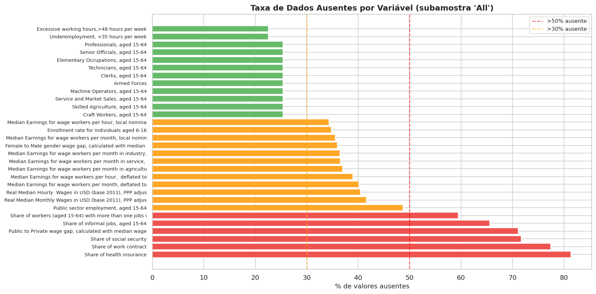
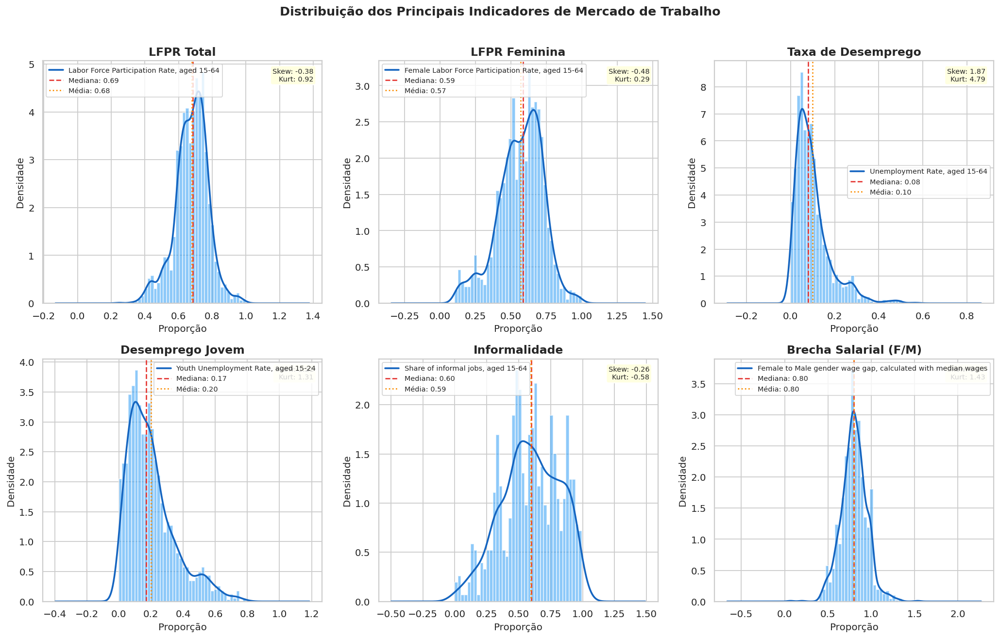
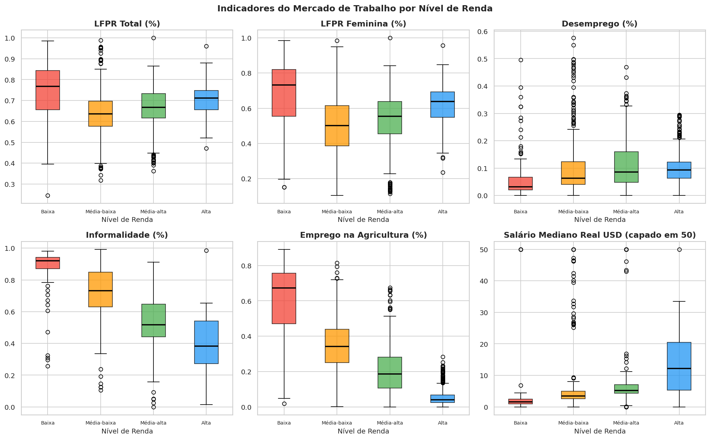
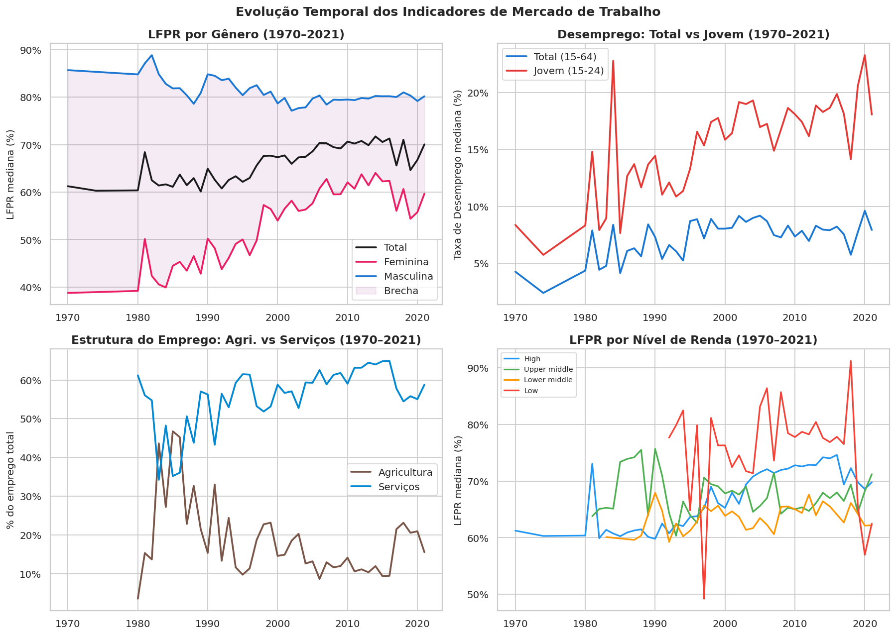
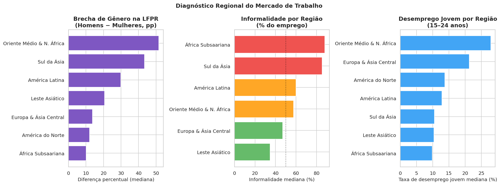
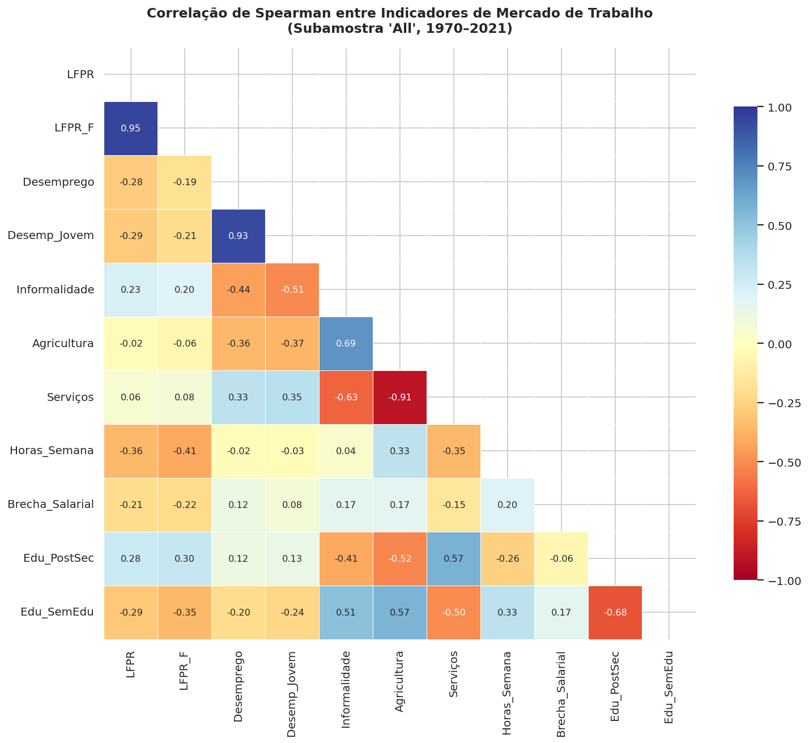
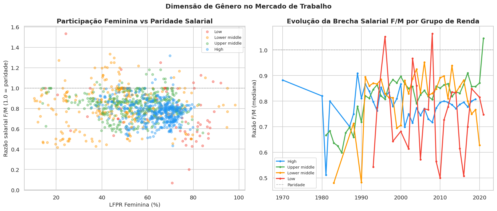
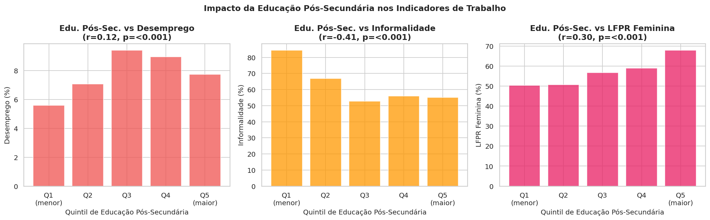

# 🌍 Análise do Mercado de Trabalho Global — EDA & Machine Learning

**Python 3.13+** | **Banco Mundial — I2D2** | **Período: 1970–2021** | **Status: Em Desenvolvimento**

Projeto de Análise Exploratória de Dados (EDA) e Machine Learning sobre o mercado de trabalho global, utilizando dados do **Banco Mundial (I2D2)**. O objetivo é identificar tendências de emprego, informalidade, brechas de gênero e evolução salarial entre **1970 e 2021**.

---

## 📌 Objetivos

- Mapear tendências globais de emprego e desemprego ao longo de 50 anos
- Analisar a evolução da informalidade no mercado de trabalho
- Identificar e quantificar brechas de gênero em diferentes regiões
- Desenvolver modelos preditivos para indicadores do mercado de trabalho

---

## 📁 Estrutura do Projeto

```text
analise-mercado-trabalho-global-eda-ml/
├── cadernos/
│   ├── 01_eda_mercado_trabalho.py       # Análise Exploratória Completa
│   ├── 02_engenharia_de_atributos.py    # [Em Breve] Limpeza e Engenharia de Dados
│   └── 03_modelagem.py                 # [Em Breve] Machine Learning e Modelagem
├── relatórios/
│   ├── relatorio_executivo.md           # Resumo dos principais insights
│   └── figuras/                         # Gráficos gerados pela análise
├── .gitignore
├── requisitos.txt
└── README.md
```

---

## 🚀 Como Executar

### 1. Clone o repositório

```bash
git clone https://github.com/dudumelo98/analise-mercado-trabalho-global-eda-ml.git
cd analise-mercado-trabalho-global-eda-ml
```

### 2. Instale as dependências

```bash
pip install -r requisitos.txt
```

### 3. Execute a análise exploratória

```bash
python cadernos/01_eda_mercado_trabalho.py
```

---

## 🛠️ Tecnologias Utilizadas

| Biblioteca | Uso |
|---|---|
| `pandas` | Manipulação e análise de dados |
| `numpy` | Computação numérica |
| `matplotlib` | Visualizações estáticas |
| `seaborn` | Visualizações estatísticas |
| `scipy` | Análise estatística |
| `openpyxl` | Leitura de arquivos Excel |

---

## 📊 Roadmap

- [x] Análise Exploratória de Dados (EDA)
- [ ] Feature Engineering e limpeza de dados
- [ ] Modelagem com Machine Learning
- [ ] Relatório executivo completo com insights

---

## 📄 Fonte dos Dados

Os dados utilizados neste projeto são provenientes do **Banco Mundial — I2D2 (International Income Distribution Database)**, cobrindo indicadores de emprego, salário e condições de trabalho de múltiplos países entre 1970 e 2021.

> 🔗 [World Bank Open Data](https://data.worldbank.org/)

---

## 📈 Principais Insights

Os insights detalhados estão disponíveis no [Relatório Executivo](relatórios/relatorio_executivo.md).

---

## 📊 Visualizações

### 1. Dados Faltantes


### 2. Distribuições


### 3. Análise por Renda


### 4. Tendências Temporais


### 5. Análise Regional


### 6. Correlação entre Variáveis


### 7. Análise de Gênero


### 8. Educação e Trabalho


---

## 👤 Autor

Desenvolvido por **[Duilio Melo](https://github.com/dudumelo98)**
